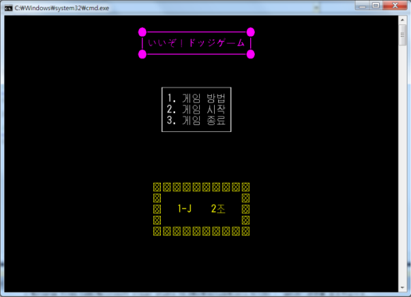
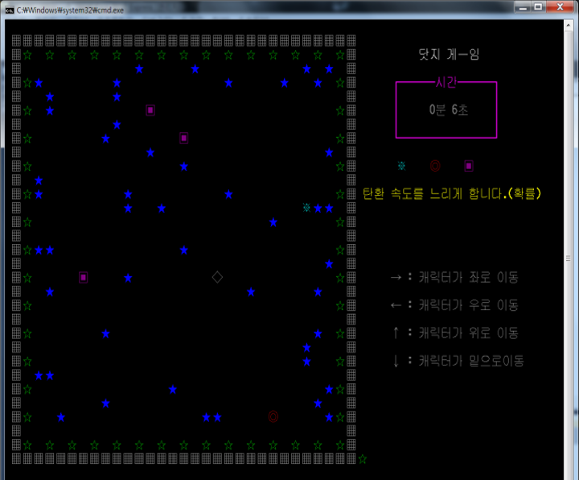
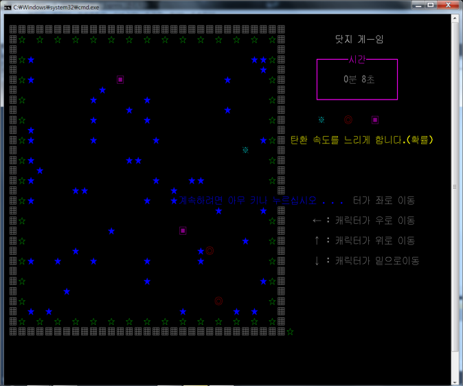

# iizo-dodge-game
iizo-dodge-game is a dodge game written in C. This team-project was developed when I a student.

# How to Play
1. Build this project and execute .exe file
2. Press '1' Key for game start (Press '2' for show how to play written korean. 3 is exit program)
3. Bullets do 360 degree move randomly. Avoid bullets for as long as possible.
4. If you get any item, Bullets slow down for a period of time.
4. (Keyboard) Arrows : move

# Game Screenshot
### Main

### Game

### Game Over
